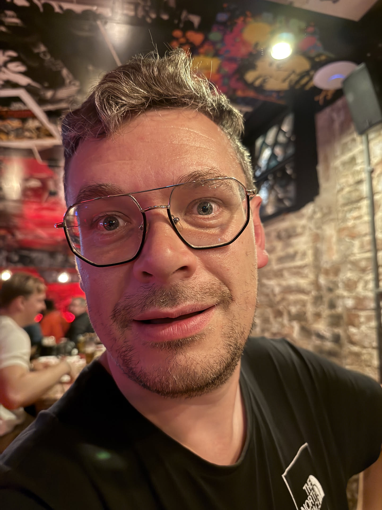
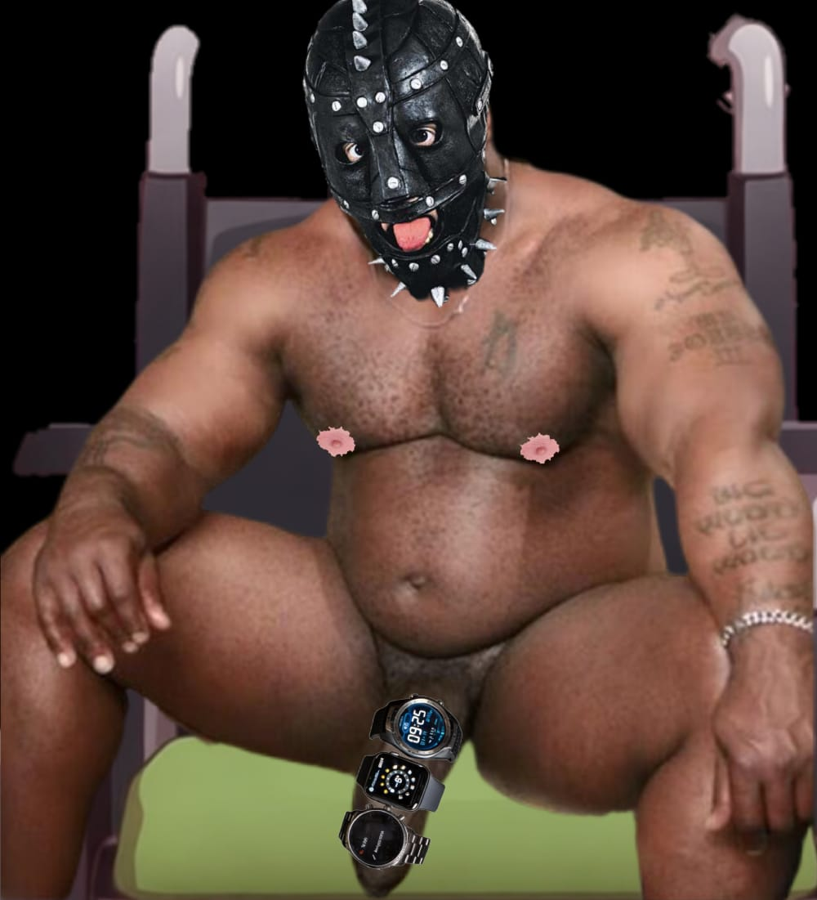
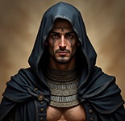
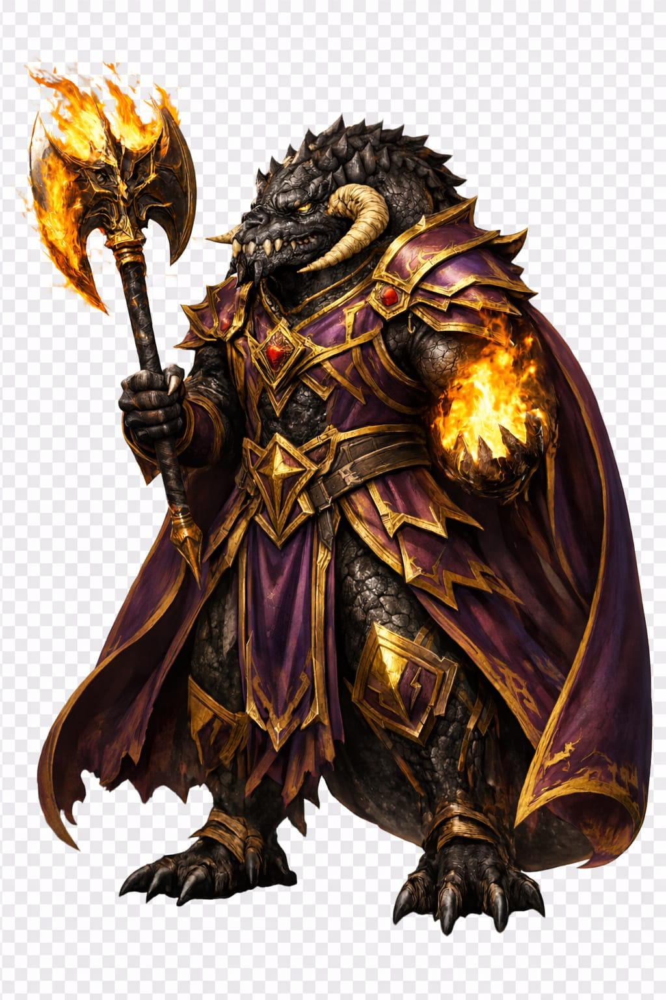

| Ed Taylor 🗡️ | Bill 🎶 | Nesu Akhekh 🛡️ | The Irish Wannabe 🩸 |
|-----------|------------------|------------------|-----------|
|  |  |  |  |
| **Halfling** Rogue | **Goliath** Bard | **Human** Paladin | **Dragonborn** Bloodhunter |
| Shea | Harry | Phill | Ed |

---

# Neverwinter

A D&D 5e campaign set in Aurora.

⚠️ Player-facing notes only.
DM secrets are stored separately.

## Current Arc
Exploring the myseries of **The Twink** and usually getting into fights with innocent civilians.

---

## Session Logs

- [Session 01 – Sunday 7th December 2025](sessions/session-01.md)
- [Session 02 – Sunday 28th December 2025](sessions/session-02.md)
- [Session 03 – Sunday 4th January 2026](sessions/session-03.md)
- [Session 04 – Sunday 18th January 2026](sessions/session-04.md)
- [Session 05 – Sunday 15th February 2026](sessions/session-05.md)
